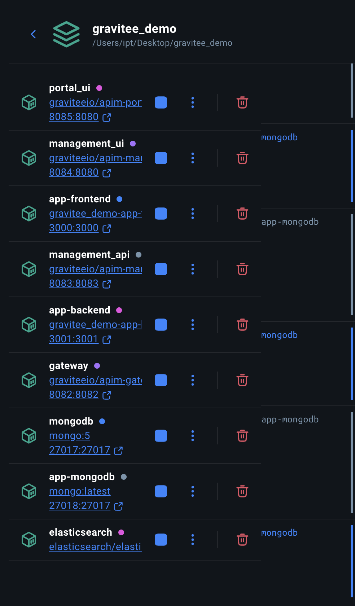
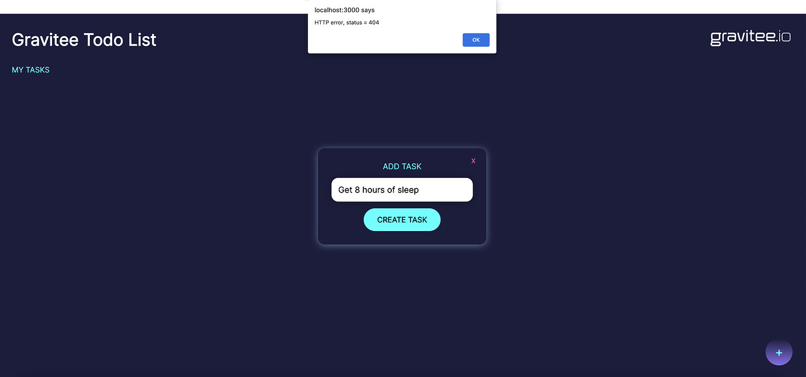
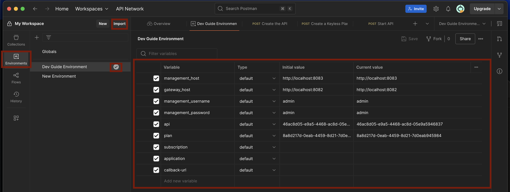
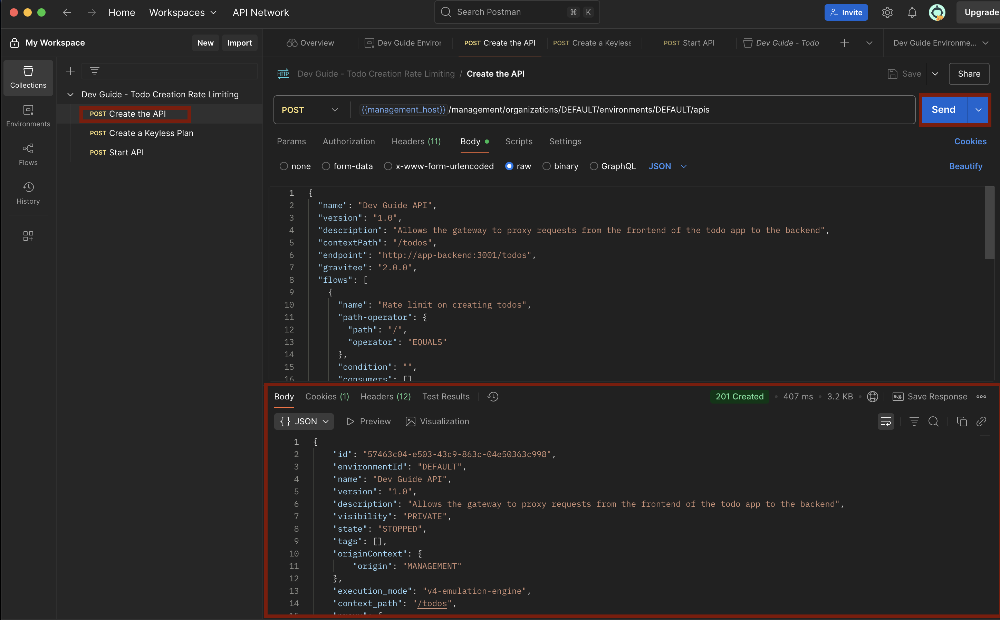
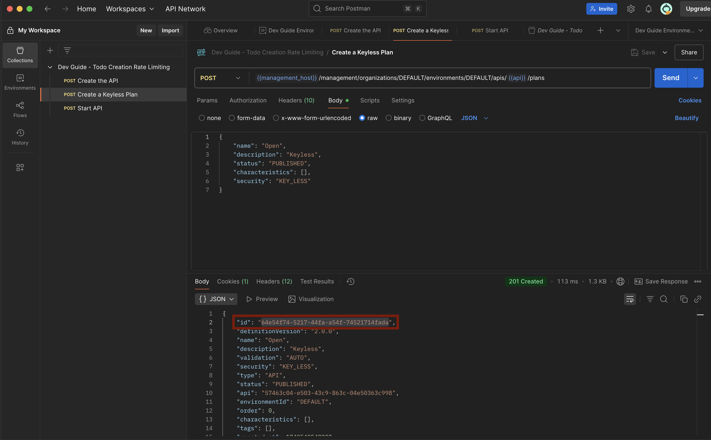
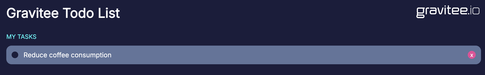
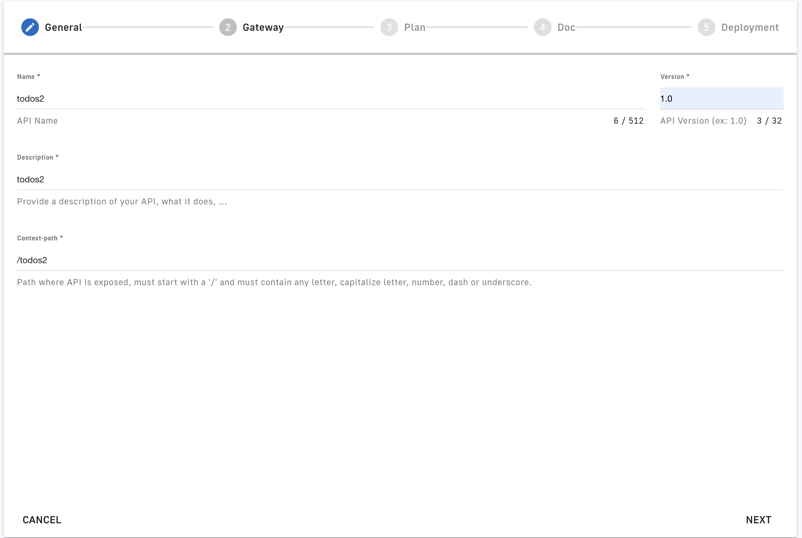
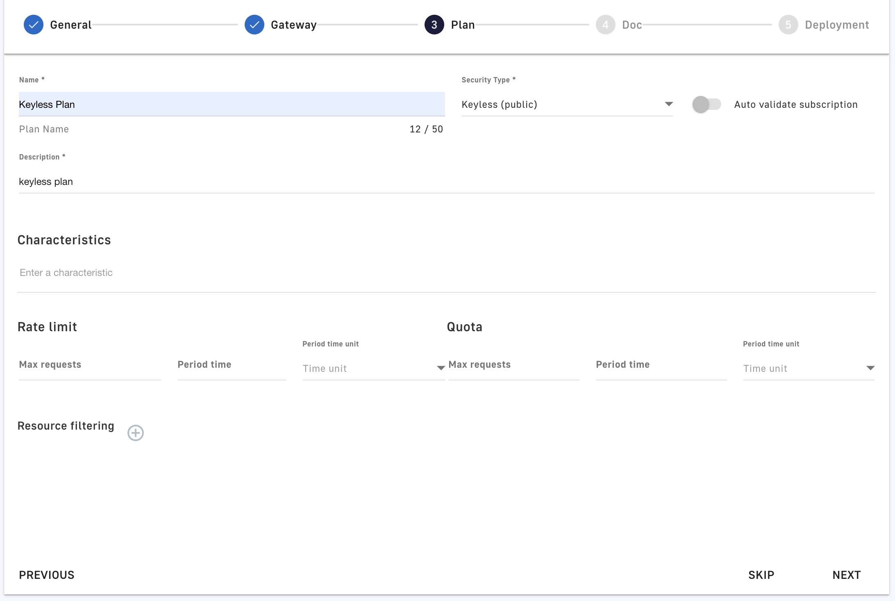
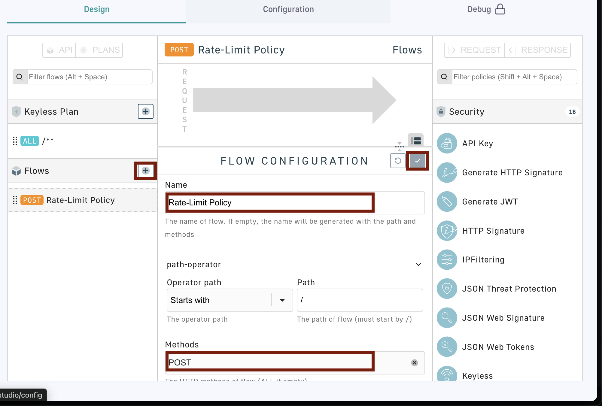
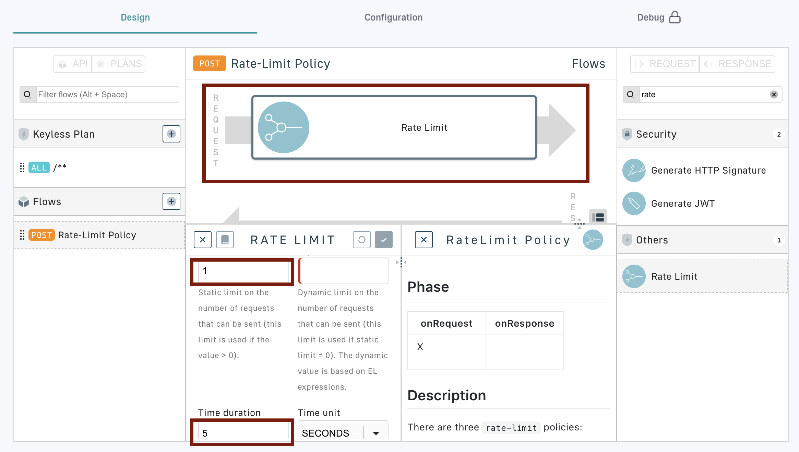

# API Gateway Demo
## Introduction

What you will learn:

* What is an API gateway. Why is it required and what are its tasks.
* Connect the frontend of a simple ToDo app with a backend by exposing the API using Gravitee, an open-source API management platform that provides tools to secure, publish, manage, and monitor APIs.
* What are plans and flows (aka policies) and how to add them to the API gateway using yaml files or through the Gravitee UI.
* Future: Adding AM (Access Management) to the API gateway, more interesting policy examples

What you need:

* Docker
* Postman Desktop App (API development and testing tool, allows us to easily make requests to the gateway and see the corresponding responses.)

If you are completely new to certain basic topics, I recommend taking a look at: [Basics](https://community.gravitee.io/t/part-1-the-essentials/1458)
It includes small introductions to APIs in general, the network stack and its protocols, specifications such as OpenAPI, etc.

You can find a more in-depth introduction into API gateways here: https://community.gravitee.io/t/part-2-gravitee-key-concepts-and-core-offerings/1459
This introduction uses Gravitee as an example, but many of the key concepts apply generally regardless of the used API management tool. I recommend having a lookt at:
* [Overview](https://community.gravitee.io/t/part-2-gravitee-key-concepts-and-core-offerings/1459)
* [API Gateway: Policies and Plugins](https://community.gravitee.io/t/part-2-gravitee-key-concepts-and-core-offerings/1459#api-gateway-policies-and-plugins-5)

## DEMO
The following tutorial is based on: [Gravitee Demo](https://community.gravitee.io/t/part-3-getting-started/1460). You can also follow the steps there. However, the tutorial uses Thunder Client which requires a license in order to follow the steps. We use Postman instead.

## Docker
First you need to run the containerized application:
```
docker compose up -d
```

The Docker Desktop app will now show you all of the containers running in the container.


If you are interested in how these containers are connected, you can have a look at the [docker-compose.yaml](./docker-compose.yml)


## ToDo App

Let's start the ToDo Application. In the Docker Desktop App click on the link under the app-frontend container (gravitee_demo-app-3000:3000). This will open the app in your web browser. Try to add a new item to the list by clicking on the "+" sign at the bottom right corner. You should get a 404 error message.


So what happened here? The application is tied to an API that comunicates with a database on the backend. When you cliked the "+"-button, a HTTP POST was sent to the gateway. We havent setup the gateway yet, so it didn't know how to proxy this request and responded with a 404.
Let's fix that.

## Management API
There are two options to create an API and deploy it on a Gravitee gateway. You can either use the management API or the management console. Let's start with the mangement API. For this you will need to start the Postman Desktop App. 

### Postman
Postman is a neat tool to create and deploy an API on your gateway. It can import an environment and collections of API calls from a .json file.

Let's start by creating an environment in Postman. An environment allows you to specify certain variables that you can reuse in your collections, such as the address of the gateway host etc.. For this, click to the "Environments" Tab on the left of the Postman App, then click on "Import" and select the file in `postman-collections/getting-started/postman-environment.json`. Activate the "Dev Guide Environment" by clicking on the checkmark next to it. Make yourself familiar with the variables you just created for this environment.
Note that the api and plan variables will not be set initially.


Next will add a collection. A collection allows you to specify a set of requests in order to create APIs on the Gravitee Gateway in a single .json file. The requests have already been specified for you in the `postman-collections/getting-started/Todo-Creation-Rate-Limiting_postman-collection.json`file.

The .json contains 3 items for the 3 requests. In order to add an API to the gateway you need to first create the API itself, create a plan for it and then start it. Here you can also see the use of the environment variables you created before (e.g. `{(management_host)}`). To import these collections, go to the "Import" tab on the left in the Postman app and chose the corresponding file.

Pick the "Create the API" request on the left and send the request using the blue "Send"-button on the right.
The top pane will shows you the request you just sent to the gateway and the bottom pane will show the response. If you have done everything correctly, it will provide you an unique id of the created API. Copy this id and set the api variable in the environment you created before.



What we just did is telling the gateway that all network traffic targeting the `/todos` context path should be routed to `http://app-backend:3001/todos`. Additionally, a flow was added to the API, which allows us to apply rate-limiting to all POST requests to `/todo`.

Every API requires a [plan](https://docs.gravitee.io/apim/1.x/apim_publisherguide_plans_subscriptions.html) before we can start it. A plan provides a service and access layer on your API for the consumer applications. A plan specifies access limits, subscription validation mode and other configurations to meet the specific applications needs.

We will start with a keyless plan, so we don't need to worry about authentication. Send the "Create a Keyless Plan" POST request and then you should again receive a unique identifier in the response. Copy this id and set the plan variable in you environment.



Finally, we can start the API. Do this by sending the corresponding POST request in the Postman app. It should respond with a 204 and no content. Let's see if we can use the ToDo app. Navigate to `http://localhost:3000/` in your browser and try to add an item.



Let's try to test the rate-limiting policy. Try to add two items to the list wihtin 5 seconds. You should get an HTTP error with status 429.

## Gravitee UI - Management Console
Now we will have a lookt at the management console. For this, navigate to `http://localhost:8084/` in your browser and sign in using with the username `admin` and password `admin`. The dashboard will show that you created and started one API. 

We will now add the same API via the management console. Go to the "APIs" tab and click the "Add API"-button. Click "Create V2 API". Next give the API a name and provide the context path. This is the path that the users provide in order to target a resource. In our example we used `/todo` as context path. We need to slightly modify this path, as every path needs to be unique.



After providing all the necessary details, click next and specify the backend as: `http://app-backend:3001/todos`. Multiple gateway APIs can target the same backend route. As an example, when a consumer makes a request to `http://gateway-domain:8082/todos2` the gateway will route it to `http://app-backend:3001/todos`.

Now we add a plan. Fill in everything as provided in the picture below. Ignore the "Rate limit" section for now.



Skip the Doc generation. Now you should see a summary page of your API. At the bottom you can either create the API without deploying it or you can create and start it. Go with the first option. The plan needs to be published before we can use it. Go to the "Plans" subtab and publish the "Keyless Plan" you have just created. We will still need to apply the rate limiting policy to our API before we deploy it. This is done with a `flow`. Go to the "Policy Studio" subtab of the "APIs" tab. Add a flow to the "Flows" in the left menu. Note that you can limit flows to plans like our "Keyless Plan". This allows us to define a scope for what applications should be affected by that flow. We just add it to the API itself for our demo. Name it and chose "POST" in the "Methods" section. Confirm the changes with the checkmark and click save when prompted to do so. The flow should now appear beneath the "Flows" tab. 



Next we specify the rate-limiting policy for incoming requests. In the filtering mask to the right filter for "Rate Limit" and then drag & drop the element into the request arrow. Set the number of max requests and Time duration according to the screenshot below. Confirm with the checkmark and save the changes.



Finally you need to make sure that the gateway is aware of the new API. For this you need to deploy it and then start the API in order to use it. At the top right corner you should see a "Deploy API"-button. After deployment, go to the "Info" subtab in the "APIs" tab and start the API. Congratulations! Your new API is running on the gateway.


## Acess Management
